# Никоноров Денис - FOPS-8
# Домашнее задание к занятию «Запуск приложений в K8S»

### Задание 1. Создать Deployment и обеспечить доступ к репликам приложения из другого Pod

1. Создать Deployment приложения, состоящего из двух контейнеров — nginx и multitool. Решить возникшую ошибку.
2. После запуска увеличить количество реплик работающего приложения до 2.
3. Продемонстрировать количество подов до и после масштабирования.
4. Создать Service, который обеспечит доступ до реплик приложений из п.1.
5. Создать отдельный Pod с приложением multitool и убедиться с помощью `curl`, что из пода есть доступ до приложений из п.1.

------

### Задание 2. Создать Deployment и обеспечить старт основного контейнера при выполнении условий

1. Создать Deployment приложения nginx и обеспечить старт контейнера только после того, как будет запущен сервис этого приложения.
2. Убедиться, что nginx не стартует. В качестве Init-контейнера взять busybox.
3. Создать и запустить Service. Убедиться, что Init запустился.
4. Продемонстрировать состояние пода до и после запуска сервиса.

---

### Решение задания 1. Создать Deployment и обеспечить доступ к репликам приложения из другого Pod

1. Создаю отдельный Namespace, чтобы созданные в этом задание pods, deployments, services работали отдельно от остальных

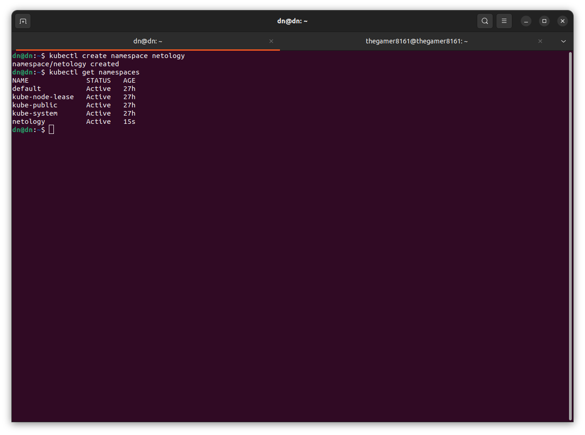

Далее манифест Deployment приложения [deployment-nginx-multitool](/deployment-nginx-multitool.ymldeployment-nginx)

Произвожу его запуск

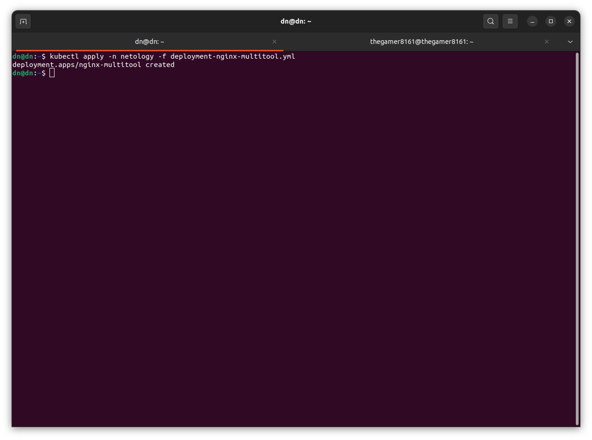

Проверка

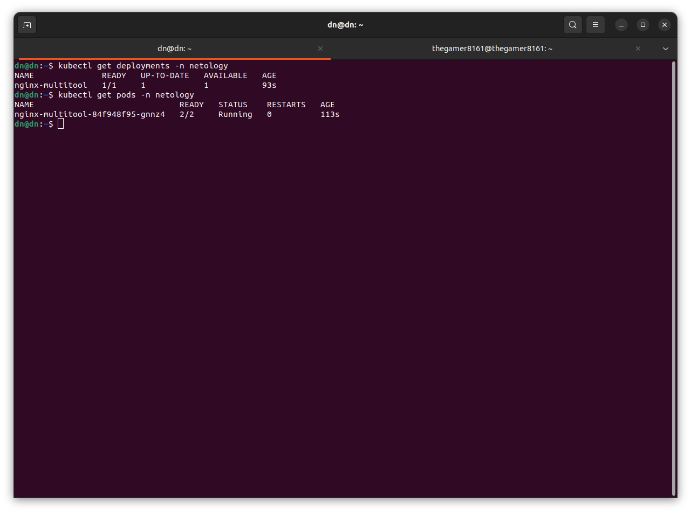

2. Запущена одна реплика приложения nginx-multitool. Увеличение кол-ва реплик можно произвести через изменение файла [deployment-nginx-multitool](/deployment-nginx-multitool.ymldeployment-nginx) `replicas:1` меняем на `replicas:2`.
И повторно запустить `kubectl	apply -n netolgy deployment-nginx-multitool.yml`

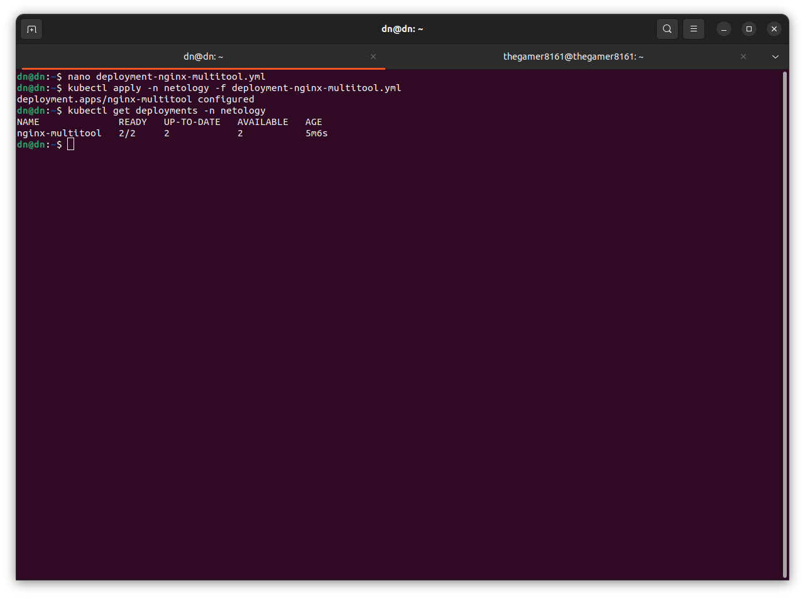

Видно что стало два запущеных пода.

До этого было 1

После стало 2
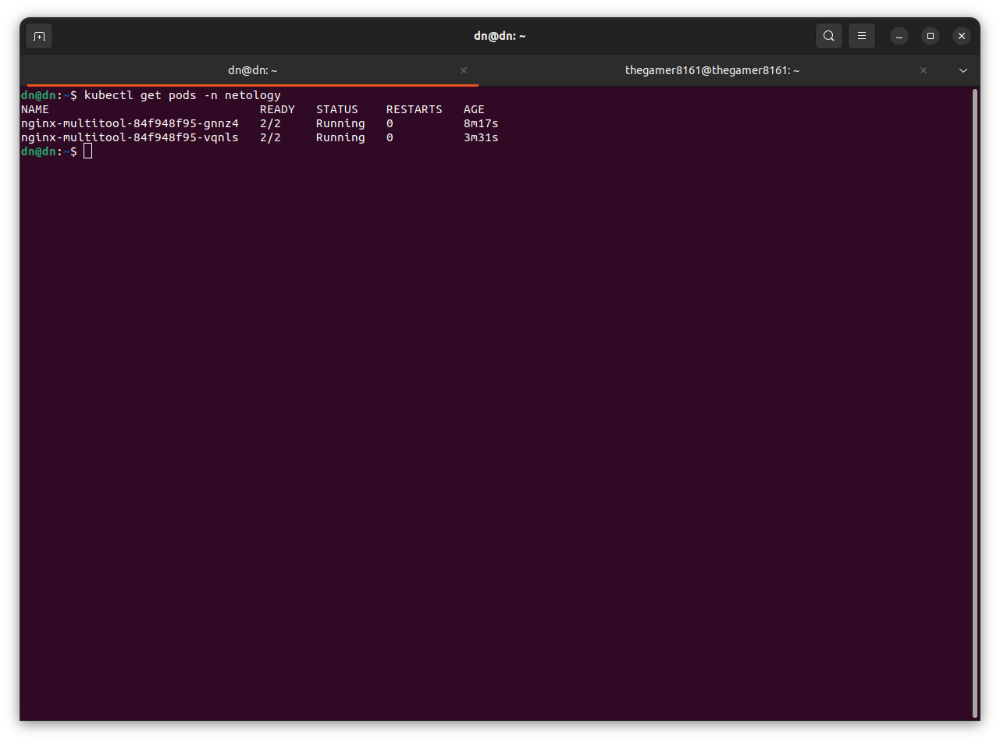

Написан манифест Serivce [nginx-multitool-svc](/nginx-multitool-svc.yml)

Запуск данного манифеста

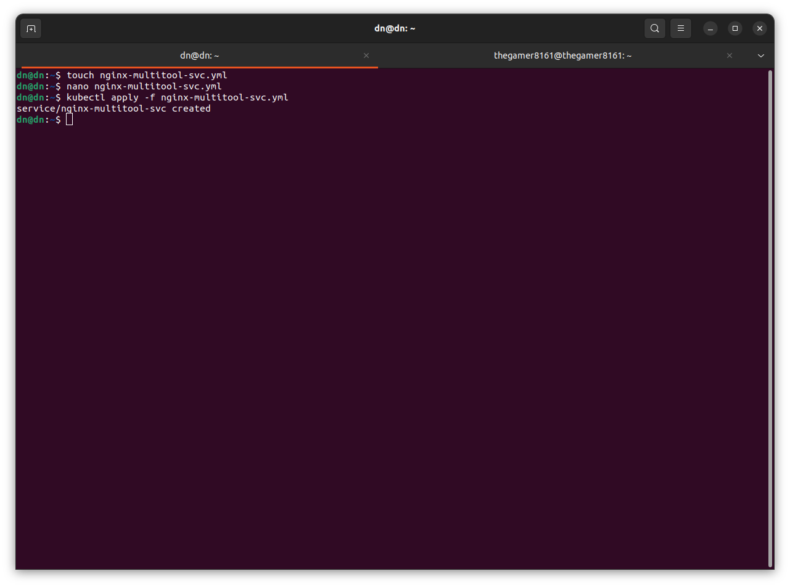

Проверка и видим что все создалось.

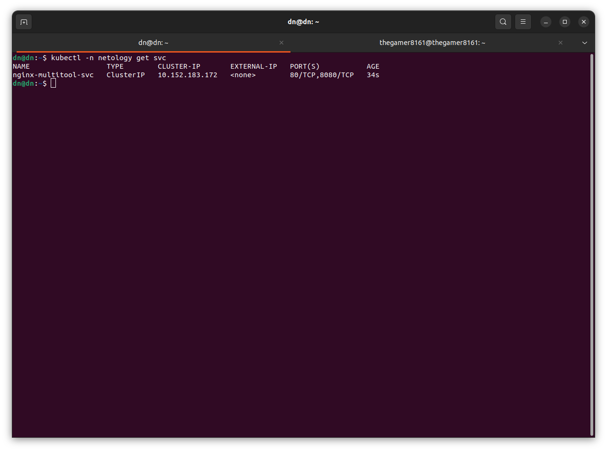

Написан манифест отдельного пода [multitool](/multitool.yml) и запускаю.

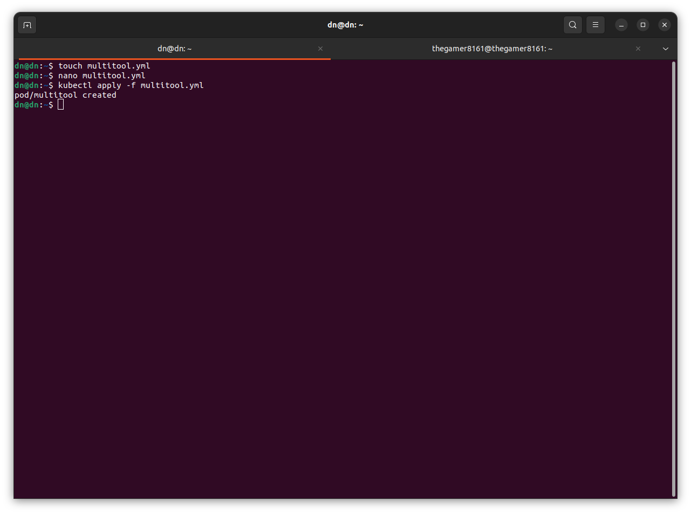

Проверка подов в namespace netology

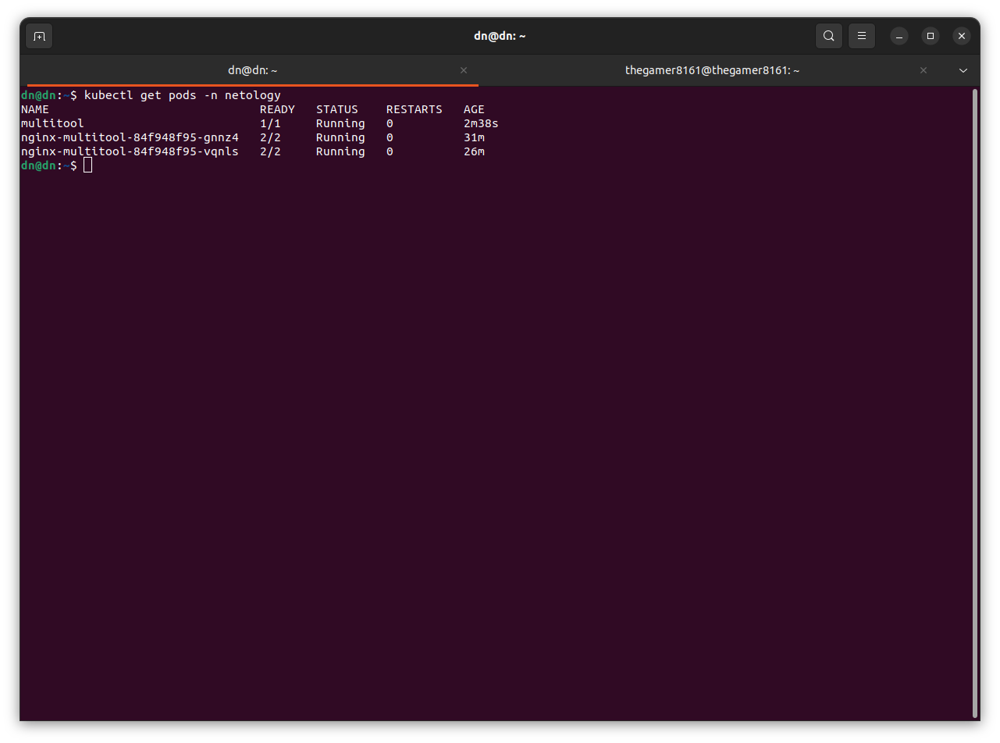

Под поднялся.

С помощью `curl`, проверяю из пода multitool доступ до приложений из п.1:

Сначала на порт 80
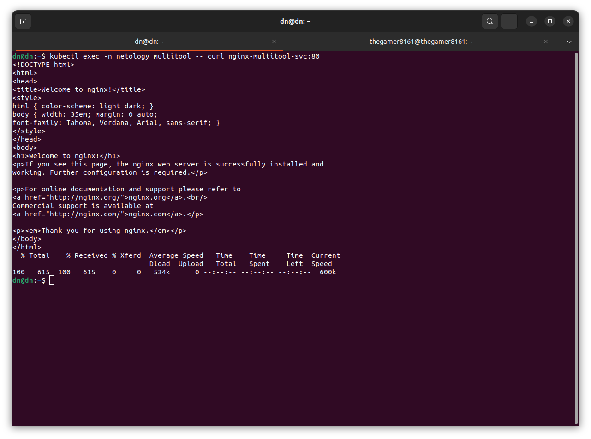

Теперь на порт 8080
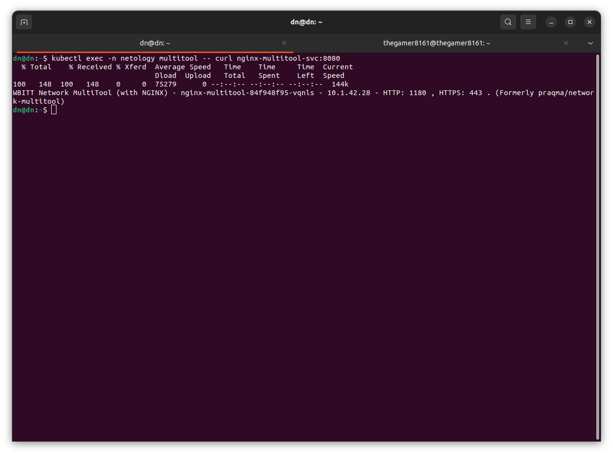

### Решение задания 2. Создать Deployment и обеспечить старт основного контейнера при выполнении условий

1. Создан манифест Deployment приложения nginx, который запустится только после запуска сервиса.
[nginx-init-deploy](nginx-init-deploy.yml)

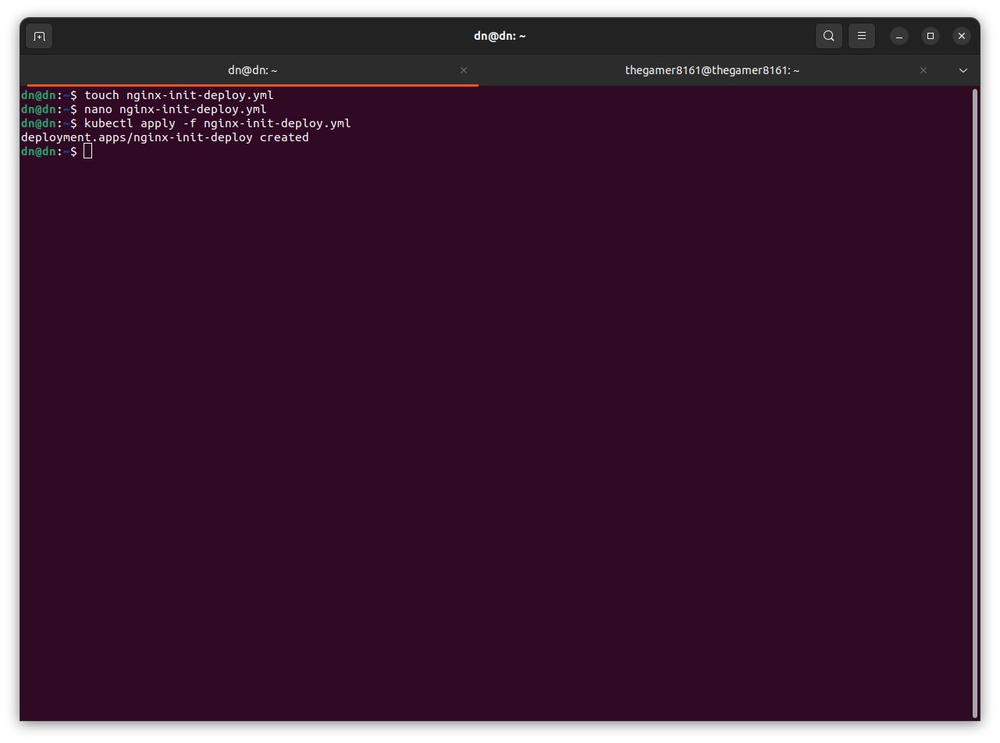

Проверка запустился ли под

Создан манифест Service [nginx-init-svc](/nginx-init-svc.yml)
Запуск и проверка.
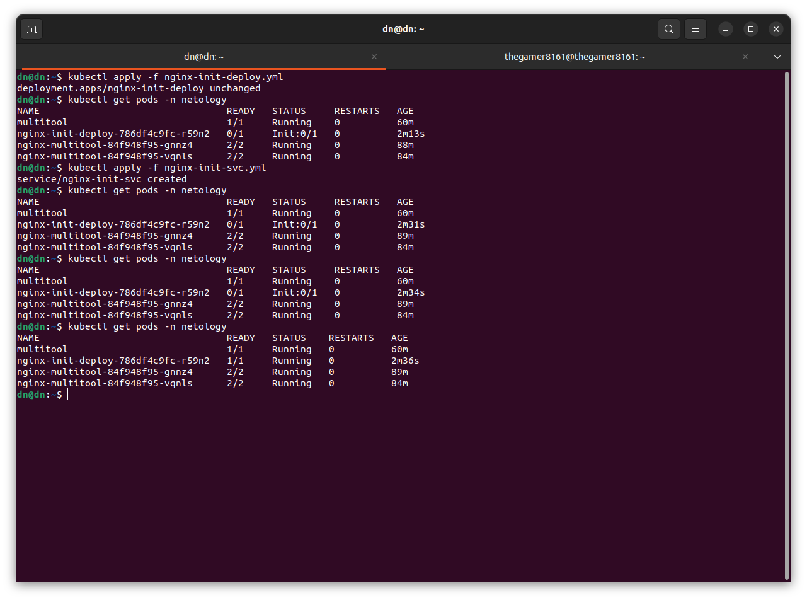
